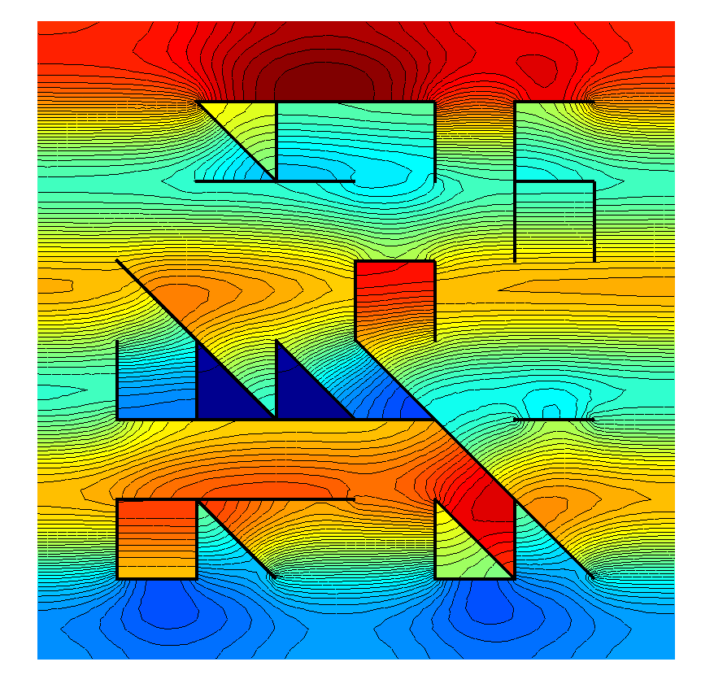
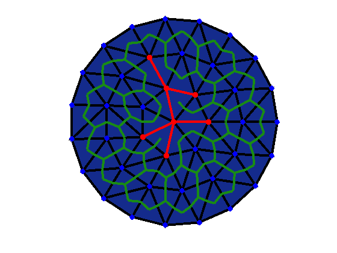
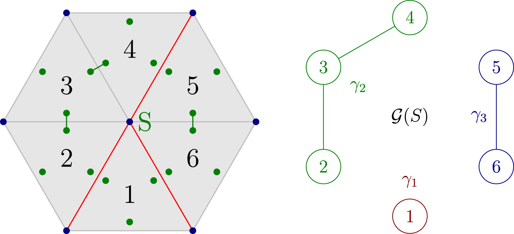

# Generalized meshes


This Matlab toolbox contains implementations for the methods described in the paper <br>
[Averseng, Claeys, Hiptmair: Fractured Meshes. <i>FINEL</i> (2023)](https://www.sciencedirect.com/science/article/pii/S0168874X22001809) <br>
It allows to define and manipulate <i> Generalized meshes</i>, which is a structure modeling meshes of non-manifold geometries. It includes in particular fractured meshes, useful for Finite Element Methods (FEM) in fractured domains, and inflated meshes useful for Boundary Element Methods (BEM) for non-manifold boundaries (see, e.g., [this paper](https://arxiv.org/abs/2310.09204) and [this repository](https://github.com/MartinAverseng/multi-screen-bem3D-ddm/)).

| FEM Solution of a 2nd order boundary value problem in a randomly generated "fracture network" with Neumann conditions at the boundary | FEM in space/FD in time solution of the wave equation in the complement a complex obstacle |
:----:|:-----:
|||


## What is a Generalized Mesh

### Definition

A n-dimensional generalized mesh is defined by supplying

- An ordered list <math>L = (S1,S2,...,SN) </math> of n-simplices, allowing repetitions and arbitrary overlaps,
- Some adjacency information between the elements of this list.

The adjacency specifies, for each element i = 1,...,N, and each (n-1)-dimensional face <math>F</math> of the simplex Si, whether i has a neighbor element j <i>through</i> <math>F</math>. It must satisfy the following axioms.

(i) If elements i and j are adjacents through F, then F is a facet of both Si and Sj <br>
(ii) Adjacency is symmetric: element i is adjacent to j through F <i>iff</i> element j is adjacent to i through F<br>
(iii) For each facet <math>F</math> of Si, element i is adjacent to <i>at most</i> one element j through <math>F</math>

### Examples


#### Regular meshes

Every <i>regular</i> mesh (of a manifold geometry) can be regarded as a Generalized meshes, by making two elements adjacent through F if and only if Si interesected with Sj is equal to F. Given a regular mesh `m` represented by a Gmsh-like structure (vertices,elements), call the class constructor
```
M = GeneralizedMesh(m)
```
to construct the corresponding generalized mesh.


#### Fractured meshes

Generalized meshes can also represent more complex geometries. Fractured meshes, such as the one represented below are important examples: they correspond to regular n-dimensional meshes in Rn, where some adjacencies have been "dropped" at some (n-1) dimensional interelement interfaces, creating a <i>fracture</i> (red edges below). They can be instanciated by calling
```
M = fracturedMesh(mOmega,mGamma)
```
where `mOmega` is a n-dimensional regular mesh and `mGamma` is a (n-1)-dimensional such whose elements are all faces of some simplex in `mOmega`.


<div>

</div>

#### Inflated meshes

Generalized meshes can also represent more exotic geometries than fractured domains, for instance by having several elements on top of each other. An important example is given by so-called <i>virtually inflated meshes</i> which naturally appear as the <i>boundaries</i> of fractured meshes, more on this below.


## Class definition and methods

### Properties

The class definition of GeneralizedMesh is

```
classdef GeneralizedMesh

    properties
        vtx; % Nvtx x 3 array of reals (coordinates)
        elt; % Nelt x (n+1) array of numbers in {1,...,Nvtx}
        nei_elt; % Nelt x (n+1) array of numbers in {0,..,Nelt}
        nei_fct; % Nelt x (n+1) array of numbers in {0,...,n+1}
    end

    ...

end
```

The pair (`vtx`,`elt`) works like for a normal Gmsh-type mesh, except now the array elt may have duplicate lines, allowing for distinct elements with the same vertices. The adjacency is encoded via `nei_elt` and `nei_fct`. For a non-zero j,
`nei_elt(i,alpha)=j` and `nei_fct(i,alpha) = beta` means that elements i and j are adjacent through the facet Falpha(i), where Falpha(i) is the (n-1)-subsimplex of Si obtained by removing vertex number alpha. In this case, one has also `nei_elt(j,beta) = i, nei_fct(j,beta) = alpha` and Falpha(i) = Fbeta(j). On the other hand, `nei_elt(i,alpha) = 0` and `nei_fct(i,alpha) = 0` is the convention when element i has no neighbor through Falpha(i).     

### Subsimplices

The d-subsimplices of a generalized mesh `M` are the d-subsets (S<sub>1</sub> ,...,S<sub>d</sub>) of the vertices of some element of `M`. Call

```  
[Slist,set2sub,sub2set] = subsimplices(M,d)
```
to get all d-subsimplices of M. The i-th line of Slist, `[Slist(i,1),...,Slist(i,d)]` encodes a unique subsimplex of `M`, referring to vertices by their index in `M.vtx`. `set2sub` is an array of size Nelt x Nd, where Nd = (d choose n) is the number of d-subsimplices per element. The k-th line of `set2sub` tells at what positions the subsimplices of element k are in `Slist`. `sub2set` is a `Nelt x N` sparse "incidence" matrix filled with 0s and 1s, with coefficient (k,i) equal to 1 when element k contains subsimplex i.

### Generalized subfacets

Generalized subfacets are the central concept related to Generalized meshes, as far as FEM and BEM are concerned. For each vertex <math>S</math> in a generalized mesh, one can partition the elements incident to <math>S</math> in connected components, with two elements in the same component if they can be linked by a chain of adjacent elements all incident to <math>S</math>. Each component gamma gives rise to a <i>generalized vertex</i> at <math>S</math>, as represented below.
<div align="center">

</div>
Generalized d-subfacets are defined analogously. Call

```
[Slist,gamma,I] = M.generalizedSubfacets(d)
```

to compute all generalized d-subfacets of `M`,  {<b>s</b> = (S,gamma)}. Generalized subfacet number i is represented as the pair <b>s</b><sub>i</sub> = (`Slist(i,:)`, `gamma{i}`) where

- `Slist(i,:)`, the i-th line of `Slist`, is the d-subsimplex S
- `gamma{i}` is the list of elements in the component gamma

Moreover, I(i) refers to the the d-subsimplex S by its index as returned by `subsimplices(M,d)`.

### Refinement

We provide a method for midpoint refinement of triangular generalized meshes. Refinements for other dimensions have not been implemented yet.
Call

```
M = M.refine(p)
```
to refine `M` p times (thereby reducing the elements diameters by a factor 2<sup>p</sup>)


### Boundary

The boundary of a n-dimensional Generalized Mesh M is a (n-1)-dimensional generalized mesh dM. Its definition is purely combinatorial, involving again chains of adjacent elements (cf the Fractured Meshes paper for details). If M stands for a normal, regular mesh, then dM stands for the usual boundary of M. The boundary of a generalized mesh is obtained by

```
dM = genBoundary(M)
```

### Intrinsic inflation

When given only the simplices of the boundary of a fractured mesh, without the adjacency information, it is possible to recover this information automatically by an algorithm involving


## Finite Element Methods in fractured Meshes

### Whitney forms on M

Spaces of discrete d-differential forms can be defined on Generalized Meshes, and these can be used to consider conforming Galerkin methods in fractured domains for 2nd order PDEs. The key idea is that the degrees of freedom of the d-dimensional finite element spaces (d= 0: P1 Lagrange, d=1: Nédélec, d=n-1:Raviart-Thomas, d=n: Piecewise constant) are exactly the generalized d-subfacets discussed above.

Here we discuss this in the simplest case of d=0. For each generalized vertex <b>s</b> = (S,gamma), the basis function ϕ<sub><b>s</b></sub> is the usual tent function at S <i>multiplied by the indicator function of the union of the elements in gamma</i>. The set of discrete 0-forms, or P1 finite element space, is the vector space spanned by {ϕ<sub><b>s</b></sub>}<sub><b>s</b> generalized vertex of M</sub>
